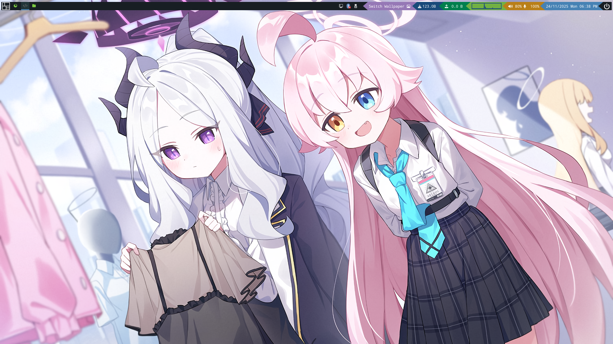
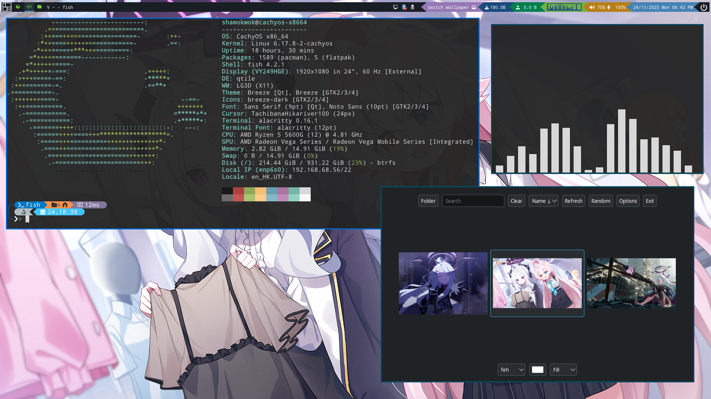

# Dotfiles

I use qtile.

## Readme

### Todo

- [ ] Desktop Manager Images
- [ ] Quick Install links

## Qtile: My main x11 WM





### Apps

Below are **ArchLinux Specific** Packages

- Qtile: `qtile`, `qtile-extras`<sup>AUR</sup>, `python-dbus-fast`, `python-psutil`
- Web Browser: `brave`
- Shell: `bash`, `fish`, `oh-my-posh`<sup>AUR</sup>
- Git: `git`, `github-cli`, `github-desktop`<sup>AUR</sup>
- Compositer: `picom`
- Fetch: `fastfetch`
- Keyring: `gnome-keyring`, `seahorse`
- Terminal: `alacritty`, `konsole`
- Editor: `code`, `kate`, `kwrite`, `nvim`
- File Manager: `dolphin`
- Archiving: `ark`
- Noification: `dunst`
- Lock: `i3lock-color`<sup>AUR</sup>, `xautolock`<sup>AUR</sup>
- Disk Manager: `udiskie`
- Clipboard Manager: `clipse-bin`<sup>AUR</sup>
- Network: `networkmanager`
- Bluetooth: `blueman`
- X11 Misc: `xorg-xrandr`
- Wayland Misc: `wlr-randr`
- Polikit Agent: `polkit-kde-agent`
- Menu: `rofi`, [rofi configs repo](https://github.com/Im-shamo/rofi)
- Resource Viewer: `btop`, `conky`, [conky configs repo](https://github.com/Im-shamo/Conky-Sysinfo-conf)
- Wallpaper: `waypaper`, `feh`, `swww`
- Display Manager (Login): `ly`
- Theming: `nwg-look`, `qt6ct-kde`<sup>AUR</sup>, `qt5ct-kde`<sup>AUR</sup>
- Themes:
	- Cursor: [Tachibana Twins](https://ko-fi.com/s/c124f987ab)
	- Cursor Help: [How to get cursor theming working in X11](https://gist.github.com/Im-shamo/64d7efba89db1a816c2c70e5ba01f770)
	- Cursor Tools: [Win -> Linux repo](https://github.com/khayalhus/win2xcur-batch)
	- Widgets: `breeze`, `breeze5`, `breeze-gtk`
	- Icons: `breeze-icons`
- Audio Video control: `playerctl`, `pavucontrol`, `alsa-utils`
- Screenshot: `spectacle`
- Screen Brightness: `blight`<sup>AUR</supu>
- Fonts: `nerd-fonts`, `ttf-hack`, `ttf-dejvu`, `noto-fonts`, `noto-fonts-emoji`, `noto-fonts-cjk`
	
For you to copy and install

```bash
pacman -Syu --needed \
    qtile python-dbus-fast python-psutil        \
    picom gnome-keyring seahorse brave          \
    fastfetch git github-cli fish bash          \
    alacritty konsole code kate kwrite nvim     \
    dolphin dunst udiskie networkmanager        \
    blueman xrandr wlr-randr polkit-kde-agent   \
    rofi btop conky                             \
    waypaper feh swww nwg-look ly               \
    breeze breeze5 breeze-gtk breeze-icons      \
    playerctl pavucontrol alsa-utils spectacle  \
    nerd-fonts ttf-hack ttf-dejvu               \
    noto-fonts noto-fonts-cjk noto-fonts-emoji
    
    
```

```bash
yay -S --needed qtile-extras i3lock-color       \
    xautolock clipse-bin qt5ct-kde qt6ct-kde    \
    blight github-desktop oh-my-posh
    
```


### Todo

- [x] Identify laptop and desktop
- [ ] Resolution Changing Bars
- [ ] Scratchpad
- [ ] Fix Keyring

## Hyprland: My main Wayland WM

### Todo

## Scripts

### Todo
